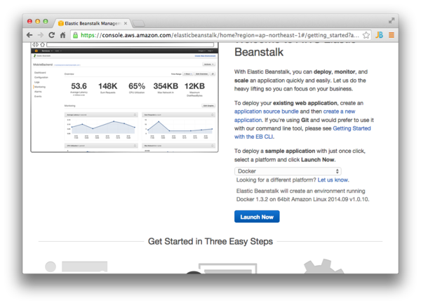
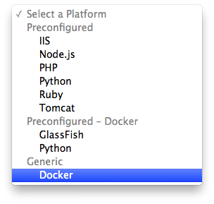
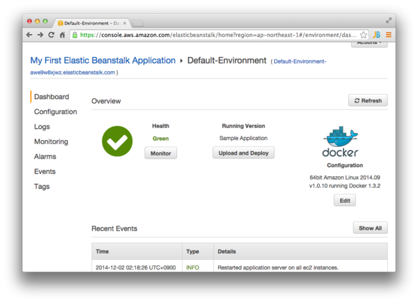

# Spring Boot Docker Blank

Maven archetype to create a docker-configured maven project for Spring Boot Application

## How to use

with Bash

    mvn archetype:generate\
     -DarchetypeGroupId=am.ik.archetype\
     -DarchetypeArtifactId=spring-boot-docker-blank-archetype\
     -DarchetypeVersion=2.0.0

with CommandPrompt (Windows)

    mvn archetype:generate^
     -DarchetypeGroupId=am.ik.archetype^
     -DarchetypeArtifactId=spring-boot-docker-blank-archetype^
     -DarchetypeVersion=2.0.0

### Example

#### Create a project

```
$ mvn archetype:generate -B\
 -DarchetypeGroupId=am.ik.archetype\
 -DarchetypeArtifactId=spring-boot-docker-blank-archetype\
 -DarchetypeVersion=2.0.0\
 -DgroupId=com.example\
 -DartifactId=hajiboot\
 -Dversion=1.0.0-SNAPSHOT
```

#### Build the application

```
$ mvn clean package
$ mvn docker:build
[INFO] Scanning for projects...
[INFO]
[INFO] ------------------------------------------------------------------------
[INFO] Building Spring Boot Docker Blank Project (from https://github.com/making/spring-boot-docker-blank) 1.0.0-SNAPSHOT
[INFO] ------------------------------------------------------------------------
[INFO]
[INFO] --- docker-maven-plugin:0.2.3:build (default-cli) @ hajiboot ---
[INFO] Copying /Users/maki/docker/hajiboot/target/hajiboot.jar -> /Users/maki/docker/hajiboot/target/docker/hajiboot.jar
[INFO] Copying /Users/maki/docker/hajiboot/target/docker/Dockerfile -> /Users/maki/docker/hajiboot/target/docker/Dockerfile
[INFO] Copying /Users/maki/docker/hajiboot/target/docker/Dockerrun.aws.json -> /Users/maki/docker/hajiboot/target/docker/Dockerrun.aws.json
[INFO] Copying /Users/maki/docker/hajiboot/target/docker/hajiboot.jar -> /Users/maki/docker/hajiboot/target/docker/hajiboot.jar
[INFO] Building image maki/hajiboot
Step 0 : FROM dockerfile/java:oracle-java8
---> 68ec80849d58
Step 1 : VOLUME /tmp
---> Using cache
---> b1091903e1dc
Step 2 : ADD hajiboot.jar /opt/hajiboot/
---> 21a84b9f50ac
Removing intermediate container 53cebe2a27e7
Step 3 : EXPOSE 8080
---> Running in e826ecab5986
---> a9b088b7cd9c
Removing intermediate container e826ecab5986
Step 4 : WORKDIR /opt/hajiboot/
---> Running in 8dfe68220a94
---> b21e8f76b9d5
Removing intermediate container 8dfe68220a94
Step 5 : CMD java -Djava.security.egd=file:/dev/./urandom -Xms512m -Xmx1g -jar hajiboot.jar
---> Running in 8f81eae7b2d2
---> 071fbf6b6c6f
Removing intermediate container 8f81eae7b2d2
Successfully built 071fbf6b6c6f
[INFO] Built maki/hajiboot
[INFO] ------------------------------------------------------------------------
[INFO] BUILD SUCCESS
[INFO] ------------------------------------------------------------------------
[INFO] Total time: 7.352 s
[INFO] Finished at: 2015-05-04T16:26:10+09:00
[INFO] Final Memory: 22M/154M
[INFO] ------------------------------------------------------------------------
```

The name of built image will be `${USER}/<Your ArtifactId>` as default. In this example, it's `maki/hajiboot`.


Specify `-Ddocker.image.prefix=<docker image prefix>` if you want to change it.

```
$ mvn docker:build -Ddocker.image.prefix=making
...
[INFO] Built making/hajiboot
```

will build `making/<Your ArtifactId>`. In this example, it's `making/hajiboot`.


#### Deploy to Docker container

```
$ sudo docker run -p 8080:8080 ${USER}/<Your ArtifactId>
```
Access `http://<Docker Host>:8080`

### Deploy to AWS Elastic Beanstalk

At `target` directory after `mvn package`, you can find `app.zip`.

This file has been created automatically like following

```
$ zip app.zip Dockerfile Dockerrun.aws.json *.jar
```

Go to "AWS Elastic Beanstalk Management Console".



Change the platform to "Docker".



Wait a few minutes until the default environment is created.


when the "Health" gets "Green", your environment is ready.



Then, select `app.zip` you've just created and enter the application version.
Click "Deploy".


After your app is deployed, the "Health" will get "Green" again.


Access the endpoint (default-environment-XXXXXXXX.elasticbeanstalk.com), you can meet "Hello World!".


You can also know the environment info using "Spring Boot Actuator" :-)


## License

Licensed under the Apache License, Version 2.0.
